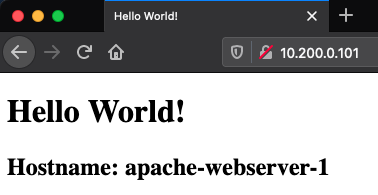
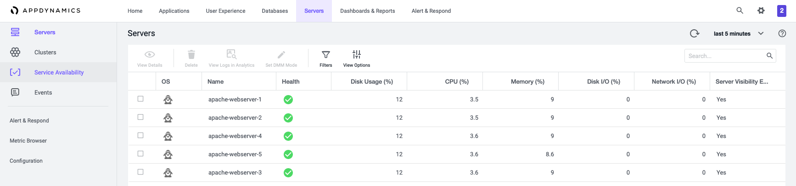
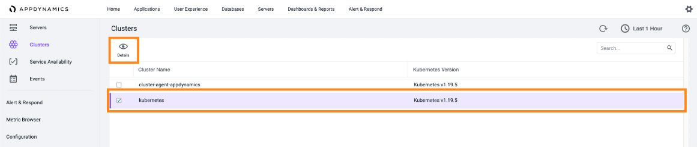
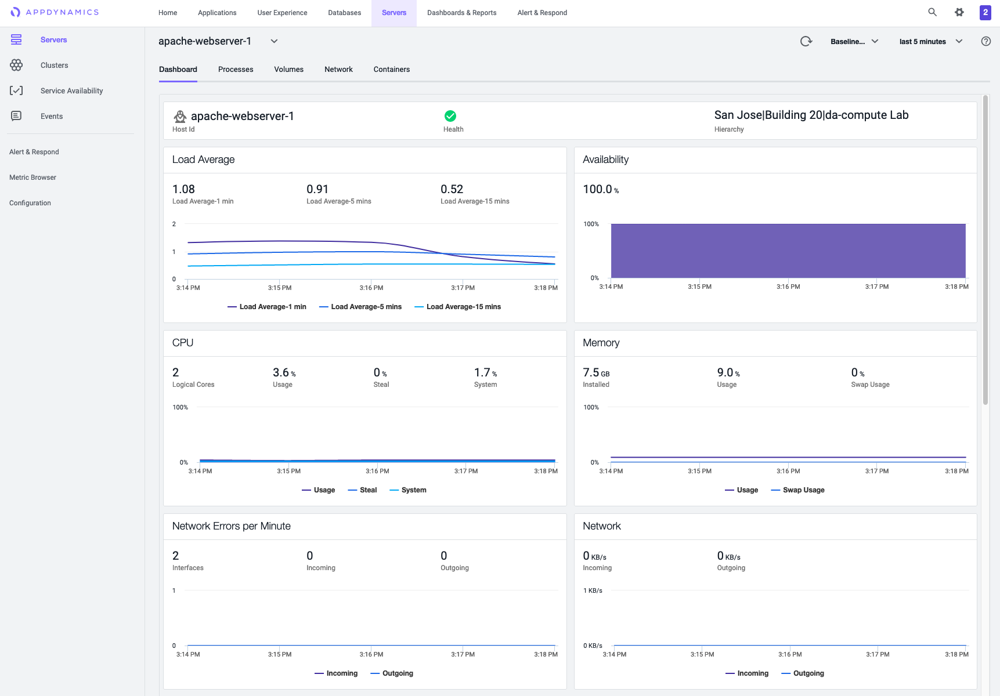
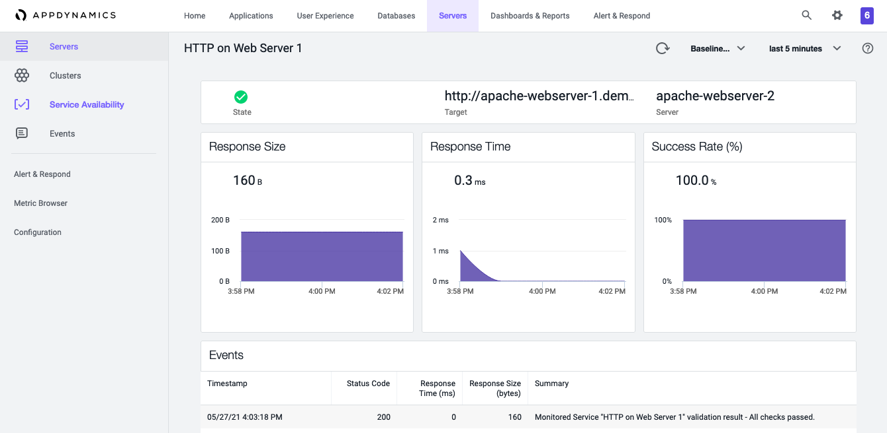

# Automate deployment of FSO Machine Agent
 This solution shows how to get started with monitoring and observability using FSO's Machine Agent and installation of the FSO `cluster-agent` on Kubernetes using Terraform. How to:
 * Use Terraform to deploy five virtual machines in vSphere followed by the installation of Apache and the FSO Machine Agent using Ansible.
 * Once Terraform provisions the virtual machines, a provisioner within Terraform calls the Ansible playbook that installs Apache, Docker, the FSO Machine and Kubernetes cluster Agents.

The main objective is to get started with monitoring your infrastructure by showing an automated way of getting the FSO agent installed, so that you have observability baked into an environment from the onset. We first start with the use case of monitoring virtual machines with follow-on use cases showing how Kubernetes clusters, databases, and applications are brought into the fold to ultimately provide a full-stack view of your operations in real time.

## Requirements

Here is a list of dependencies to make this work in your environment:

- Terraform Cloud Business (Recommended)
- vSphere 6.7 or higher
- Terraform v0.15.2 or higher
- Ansible 2.10.2
- FSO controller instance along with its credentials
- A virtual machine template with CentOS 8.2 installed as the guest OS
- Kubernetes installed - we are using Intersight IKS (Intersight Kubernetes Service) Kubernetes deployed environment
- A Kubernetes `kubeconfig` file, ours is named `iks-cluster01-kubeconfig.yml` but you can name yours with a name that makes the most sense for you but be sure to change the variable name in `main.tf`.
- Helm (we tested with version 3.3.4)
- Create your own `secret.tfvars` file with values set for variables mentioned in the lab further down in this README.md file
- Modify the variable `nsToMonitor` to ensure you are monitoring valid namespaces you would like to monitor with the Cluster Agent
## Credentials

We purposely did not add credentials and other sensitive information to the repo by including them in the `.gitignore` file. As such, if you clone this repo, you must create two files. 
- first file named `secret.tfvars` contains sensitive Terraform variables. 
- second file named `variables.yml` is used by Ansible. 
In this scenario, we encrypted `variables.yml` using the command `ansible-vault` command and decrypt it as needed locally. You could take the same approach or leave the file unencrypted if you are confident it will not be shared or inadvertently uploaded to a repo.

Here is a list of variables you must include and define for each file.

- `secret.tfvars` in HCL format (file is in the same directory as the `terraform.tfvars` file):
  - vsphere_user
  - vsphere_password
  - vsphere_server (the IP address or FQDN)
  - vsphere_vm_firmware (default is `vsphere_vm_firmware = bios`)
  - ssh-pub-key (an SSH key used with a service account that allows Ansible to connect over SSH)
  - service_account_username
  - service_account_password
- `variables.yml` (written in YAML) file:
  - CONTROLLER_HOST (the URI of the FSO Controller)
  - CONTROLLER_PORT (typically 443)
  - ACCOUNT_NAME (FSO Account Name)
  - MACHINE_PATH (a hierarchy that is separated with a | For example: San Jose|Rack1|)
  - ACCOUNT_ACCESS_KEY (this value is available in the FSO Controller)
  - APPD_BEARER_TOKEN (is the token that is derived from the available image download via cURL)


## Variables values required 

Make sure the variable addressed in a terraform var files

## Credential values required in `secret.tfvar`

Terraform keeps sensitive values in a file named `secret.tfvar`and, because the values contain sensitive information such as account credentials, it's not posted here so you'll need to make one using your credentials. 

>
> Be sure to add `secret.tfvar` to your `*.gitignore` file to be sure you don't accidentally expose your credentials if you push your changes back to GitHub or other Git repository.

| Variable               | Description |
| -----------------------| ----------- |
| controller_url         | The URL of your FSO Controller passed as a FQDN and port number. For example: https://example.saas.FSO.com:443                                                  |
| controller_account     | The account name associated with you FSO Controller.            |
| controller_username    | Your username associated with the FSO Controller.               |
| controller_password    | The password of your username associated with the FSO Controller                                                                                         |
| controller_accessKey   | The account access key for your FSO Controller.                 |

>
> Be sure to add `secret.tfvar` to your `*.gitignore` file to ensure you don't accidentally expose your credentials if you push your changes back to GitHub or other Git repository.


## Example `secret.tfvar` file
```
# FSO controller credentials
controller_url       = "https://bit.saas.FSO.com:443"
controller_account   = "saas01"
controller_username  = "majid"
controller_password  = "mypassword"
controller_accessKey = "v11234567"
```

## What Terraform Provisions

In this example, Terraform uses the `vsphere` provider and a `vsphere_virtual_machine` resource to:

- Create five virtual machines from virtual machine template.
- Add the SSH key of a service account to each host.
- Run an Ansible playbook that performs the steps in the next section.

## What Ansible Installs and Configures

After Terraform creates five virtual machines, the Ansible playbook installs and configures:

- Apache Web Server
- Firewall with port 80 opened
- Docker
- DNS (resolv.conf is configured)
- FSO Machine Agent

Each Apache Web Server is configured with a custom (using a Jinja template) `index.html` page that displays the hostname.

The same approach is taken with the FSO Machine Agent. In other words, a Jinja template creates a custom file for each containing the hostname.

## Creating and Applying the Terraform Plan


## Results


### Virtual Machines

You see five virtual machines that are created with static IP addresses in vSphere.


### Apache Web Servers

Each Apache server has a custom `index.html` file that includes the hostname of the machine.



### FSO Controller

The five virtual machines appear in the FSO controller, each running an Apache Web Server, and all five appearing in the FSO controller.



Also, you will see information about your Kubernetes clusters reported to the FSO Controller by the Kubernetes Agent. To see the information, log into your FSO Controller and navigate to the Servers Tab and clicking Clusters on the left-most navigation panel.



Click any of the check box available just before the `OS` column; then click `View Details` to see that the data reported by the Machine Agent to the FSO Controller. 

You can see the data that is reported by the Machine Agent on `apache-webserver-1`.




10. To see details about the service, click the service and click `Details`.



## BayInfotech Repositories

Please visit our repositories for more detail and other projects in automation and programability:

[https://github.com/bay-infotech](https://github.com/bay-infotech)


## BayInfotech website
We are working hard to bring more automation and programmability into community. Please contact us for more detail projects and solutions

[https://bay-infotech.com](https://bay-infotech.com)


